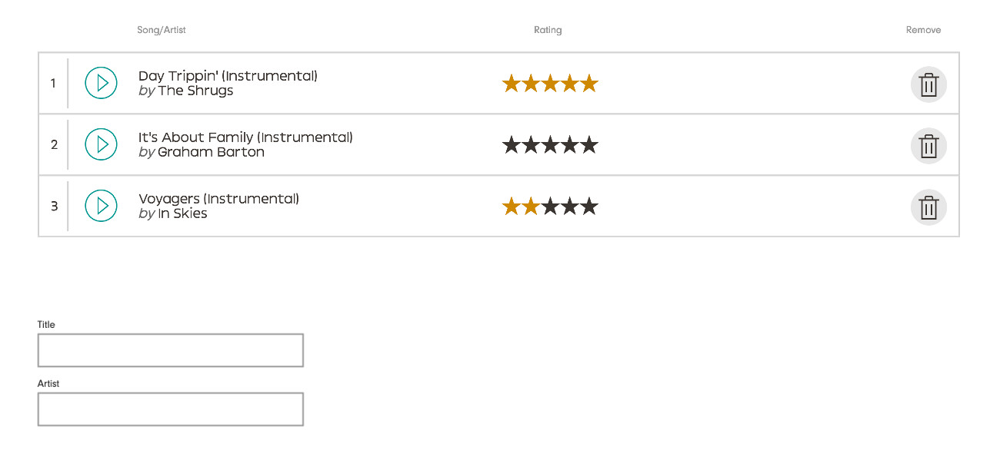

# Marmoset Frontend Code Challenge

## Objective:

In this challenge you will use react components and hooks to display a list of songs, with the ability to rate, remove and create a new song, with data persisting on the page. We have provided assets, data and the file structure/environment. Please reference the requirements and tasks below to complete the challenge.

## Setup:
* Clone this repo: ```git clone https://github.com/MarmosetMusic/marmo-frontend-code-challenge.git```
* Have Node >= 8.10 installed
* Run the environment: ```npm start``` or ```yarn start```
* Visit ```http://localhost:3000```

## Requirements:

***We ask that you take no longer than 4 hours for the challenge. It is okay if you do not finish all tasks, we want to get a sense of your work and how you structure your code***

* Build out your components in src/components
* Use Container.js to render your components
* Use hooks to manage state

## Tasks:

* Display song data, in a list format on the page
* Style list according to the output example below (don't worry about exact fonts/colors)
* Implement rating UI and persist data on the page
* Implement removing song from list and persist data on the page
* Implement rudimentary form for adding a new song (inputs: title, artist)
* Bonus: Rate a new song

**Output example:**




**Assets/Data provided:**

Inside src/assets you will find:


Inside src/data you will find:
```
{ 
  "songs": [
    {
      "artist":  "Skrillex",
      "title": "Bangarang",
      "rating": 0
    },
    {
      "artist":  "James Brown",
      "title": "I Feel Good",
      "rating": 0
    },
    {
      "artist":  "Santana",
      "title": "Smooth",
      "rating": 0
    },
    {
      "artist":  "Star Wars Theme",
      "title": "John Williams",
      "rating": 0
    },
    {
      "artist":  "Rebecca Black",
      "title": "Friday",
      "rating": 0
    }
  ]
}
```
**Notes:**

We ask that you make each task a separate commit - this way, we can easily see your progress with each step.

## To submit

* ```git bundle create marmoset.bundle master```
* Email the marmoset.bundle file to dev@marmosetmusic.com
* Subject should be "Marmo Code Challenge - YOUR NAME"
